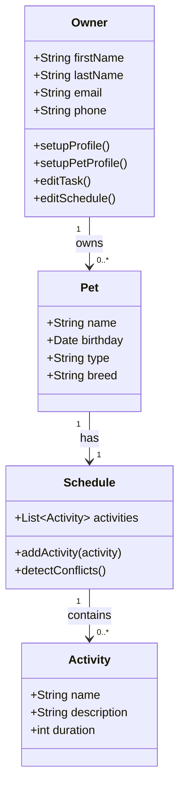

```mermaid
classDiagram
    class Owner {
        +String firstName
        +String lastName
        +String email
        +String phone
        +setupProfile()
        +setupPetProfile()
        +editTask()
        +editSchedule()
    }
    class Pet {
        +String name
        +Date birthday
        +String type
        +String breed
    }
    class Activity {
        +String name
        +String description
        +int duration
    }
    class Schedule {
        +List~Activity~ activities
        +addActivity(activity)
        +detectConflicts()
    }
    Owner "1" --> "0..*" Pet : owns
    Pet "1" --> "1" Schedule : has
    Schedule "1" --> "0..*" Activity : contains
```
